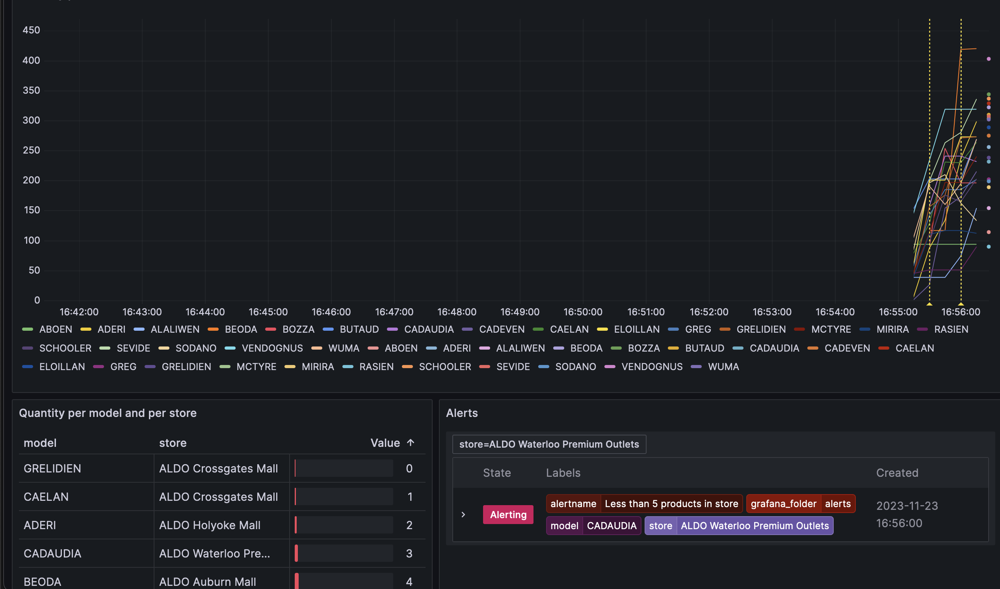

# Setup

Docker and Docker Compose are needed to launch the program.

1. Run the [inventory](https://github.com/mathieugagne/shoe-store) events with `(bin/)websocketd --port=8080 ruby inventory.rb`
2. Execute `docker-compose up`

A Grafana instance will be accessible at the following address: http://localhost:3000. A dashboard and an alert will be automatically provisioned and visible in the interface.



# Technical choices

For this exercise, we receive a structured JSON via a WebSocket that looks like this:

```json
{
  "store": "ALDO Ste-Catherine",
  "model": "ADERI",
  "inventory": 10
}
```

These are structured logs, each log contains the store name, model, and quantity. When I saw that, it made sense to use existing tools that can handle logs and visualize them.

This is how my solution works:

1. [Websocat](https://github.com/vi/websocat) is used to read the WebSocket stream
2. Logs from stdout are automatically sent to a [Fluent Bit](https://fluentbit.io/) docker image, using the native [docker fluentd logging driver](https://docs.docker.com/config/containers/logging/fluentd/)
3. Fluent Bit will ingest the logs, and expose them as [Prometheus gauge](https://prometheus.io/docs/concepts/metric_types/#gauge) metrics
4. A Prometheus instance will periodically ingest the metrics
5. A [Grafana](https://grafana.com/) instance uses the Prometheus data to show a [provisioned dashboard](https://grafana.com/docs/grafana/latest/administration/provisioning)

What's interesting with using existing observability tools is that quite a lot of features are already present; for example:

- Fluent Bit or similar tools can output to many different 'storage' (S3, Datadog, Kafka, ClickHouse, ...).
- Alerting can be handled by Grafana. It has many [integrations](https://grafana.com/docs/grafana/latest/alerting/alerting-rules/manage-contact-points/configure-integrations/#list-of-supported-integrations) (webhooks, slack, pagerduty, ..)
- Exploration: Everyone can explore the data, creates and share dashboards
- Each part can be 'easily' replaced

## Using a managed product

For this test, I created a Docker Compose file that will launch everything. In a real-life scenario, we would need to think if it's more appropriate to use a managed product instead of hosting the observability stack ourselves.

For example, we could use Elastic Cloud, Grafana Cloud, or Datadog directly. In that case, we would just have to keep the tools to push the logs and metrics.
